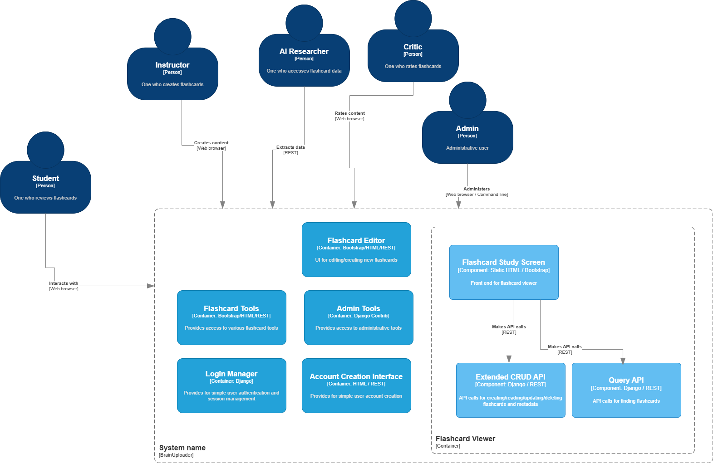

# User Stories

## Content Creator
As a content creator, I want to generate new flashcard decks, so that I can organize study materials.

### Acceptance Criteria
- User needs to be able to create new flashcard decks
- User needs to be able to clone existing flashcard decks
- User needs to be able to combine existing flashcard decks
- User needs to be able to add flashcards to deck
- User needs to be able to delete flashcards from deck
- User needs to be able to edit flashcards in own decks

## Student
As a student, I want to review information I don't know so I can learn it quickly.

### Acceptance Criteria
- User needs to be able to collect decks into stacks
- User needs to be able to review cards in stacks
- User needs to be able to search flashcards
- User needs to be able to schedule flashcards automatically

## Instructor
As an instructor, I want to share flashcard decks with other users so they can learn the material.

### Acceptance Criteria
- User needs to be able to share decks with public
- User needs to be able to share decks with specific users

## AI Researcher
As an AI researcher, I want to extract all question/answer content in a structured form so I can inform language models.

### Acceptance Criteria
- Privileged user needs to be able to extract all card data programatically with a paged API call

## Critic
As a critic, I want to review content so that other users can see what I think.

### Acceptance Criteria

- User needs to be able to leave reviews on flashcards
- User needs to be able to leave reviews on decks
- User needs to be able to flag cards as incorrect
- User needs to be able to flag cards as possibly harmful 

## Critic
As an admin, I want to perform administrative tasks so I can troubleshoot issues.

### Acceptance Criteria

- Admin needs to be able to review notifications
- Admin needs to be able to create/delete/ban users
- Admin needs to be able to change passwords
- Admin needs to be able to review flagged cards
- Admin needs to be able to delete cards

### Acceptance Criteria

- User needs to be able to leave reviews on flashcards
- User needs to be able to leave reviews on decks
- User needs to be able to flag cards as incorrect
- User needs to be able to flag cards as possibly harmful 

# Misuser Stories

## Competitor
As a competitor, I want to steal all of the flashcards so I can use them in my own product.

### Mitigation Criteria
- All-card-access API must have authentication.
- Public APIs must use throttling
- Usage limits must be in place
- Administrator must be notified when usage limits are exceeded

## Disruptive User
As a disruptive user, I want to put harmful content into shared flashcards so that other users will be upset.

### Mitigation Criteria
- Administrator must have ability to warn/ban users
- Administrator must have ability to review user-flagged content
- Automated review should be performed to determine if content should be flagged offensive

## Mistaken/Incorrect User
As a mistaken user, I want to put incorrect answers on shared flashcards so I can spread misinformation.

### Mitigation Criteria
- Users should be notified if cards in decks or with identical content are flagged incorrect
- Scorecard for decks should be visible to all users who can see the deck
- Public scorecard should be kept for users

## Identity Thief
As an identity thief, I want to steal personal information from the website so I can commit fraud.

### Mitigation Criteria
- All passwords should be hashed
- Personal information like email addresses should not be displayed on user profiles
- System should be hardened against attacks by automated testing

## Resource Hog
As a resource hog, I want to use large quantities of computing resources so I can do unreasonable things.

### Mitigation Criteria
- One account per email address
- Limits on number of users created per day per IP address
- Limits on number of API calls per day per user
- Limits on number of cards that can be shared per day

# Mockups

## Splash screen

    +------------------------------------------------------------------------------+
    |                                                                              |
    |           ______           _                                                 |
    |           | ___ \         (_)                                                |
    |           | |_/ /_ __ __ _ _ _ __                                            |
    |           | ___ \ '__/ _` | | '_ \                                           |
    |           | |_/ / | | (_| | | | | |                                          |
    |           \____/|_|  \__,_|_|_| |_|                                          |
    |                                                                              |
    |                                                                              |
    |               _   _       _                 _                                |
    |              | | | |     | |               | |                               |
    |              | | | |_ __ | | ___   __ _  __| | ___ _ __                      |
    |              | | | | '_ \| |/ _ \ / _` |/ _` |/ _ \ '__|                     |
    |              | |_| | |_) | | (_) | (_| | (_| |  __/ |                        |
    |               \___/| .__/|_|\___/ \__,_|\__,_|\___|_|                        |
    |                    | |                                                       |
    |                    |_|                                                       |
    |                                                                              |
    |                                                                              |
    +------------------------------------------------------------------------------+

## Login screen

    +------------------------------------------------------------------------------+
    |                                                                              |
    |                                                                              |
    |                  Username: ___________                                       |
    |                  Password: ___________                                       |
    |                                                                              |
    |                  |LOGIN|                                                     |
    |                                                                              |
    |                                                                              |
    |                  Forgot password?                                            |
    |                  New User                                                    |
    |                                                                              |
    |                                                                              |
    |                                                                              |
    |                                                                              |
    |                                                                              |
    |                                                                              |
    |                                                                              |
    |                                                                              |
    |                                                                              |
    +------------------------------------------------------------------------------+

Consider adding captcha to login screen

Note: The forgot password screen will be left as a simple note saying to email the admin
for now; they can follow a very straightforward and similar design once we
add email connectivity, 2fa, SAML integration with popular platforms, etc.

## New user screen

    +------------------------------------------------------------------------------+
    |                                                                              |
    |                                                                              |
    |                  Username: ___________                                       |
    |                  Password: ___________                                       |
    |                  Password (again): _________                                 |
    |                  Email address: _________                                    |
    |                                                                              |
    |                                                                              |
    |                  |CREATE USER|                                               |
    |                  |GO BACK|                                                   |
    |                                                                              |
    |                                                                              |
    |                                                                              |
    |                                                                              |
    |                                                                              |
    |                                                                              |
    |                                                                              |
    |                                                                              |
    |                                                                              |
    +------------------------------------------------------------------------------+

## Review screen, question mode

    +------------------------------------------------------------------------------+
    |                                                 |EDIT|  |ADD NEW|  |TOOLS|   |
    |          Q: +----------------------------------------+                       |
    |             |                                        |      Stats:           |
    |             |   The rain in Spain falls mainly       |      +--------------+ |
    |             |   on the _____?                        |      | N Right: 8   | |
    |             |                                        |      | N Wrong: 2   | |
    |             |                                        |      | Pct: 80%     | |
    |             |                                        |      |              | |
    |             |                                        |      |              | |
    |             |                                        |      |              | |
    |             |                                        |      |              | |
    |             +----------------------------------------+      +--------------+ |
    |                             |FLIP|           |:)| |:(|                       |
    |                        |WRONG|  |RIGHT|                                      |
    |                             |SKIP|              |FLAG|                       |
    |                                                                              |
    |                                                                              |
    |                                                                              |
    |                                                                              |
    |                                                                              |
    +------------------------------------------------------------------------------+

## Review screen, answer mode

    +------------------------------------------------------------------------------+
    |                                                 |EDIT|  |ADD NEW|  |TOOLS|   |
    |          A: +----------------------------------------+                       |
    |             |                                        |      Stats:           |
    |             |    plain                               |      +--------------+ |
    |             |                                        |      | N Right: 8   | |
    |             |                                        |      | N Wrong: 2   | |
    |             |                                        |      | Pct: 80%     | |
    |             |                                        |      |              | |
    |             |                                        |      |              | |
    |             |                                        |      |              | |
    |             |                                        |      |              | |
    |             +----------------------------------------+      +--------------+ |
    |                             |FLIP|           |:)| |:(|                       |
    |                        |WRONG|  |RIGHT|                                      |
    |                             |SKIP|              |FLAG|                       |
    |                                                                              |
    |                                                                              |
    |                                                                              |
    |                                                                              |
    |                                                                              |
    +------------------------------------------------------------------------------+

## Edit screen

    +------------------------------------------------------------------------------+
    |                                                                              |
    |                                                                              |
    |                                                                              |
    |                                                                              |
    |             Deck: v___Test Deck________________                              |
    |                                                                              |
    |                                                                              |
    |          Q: +----------------------------------------+                       |
    |             |                                        |                       |
    |             |   The rain in Spain falls mainly       |                       |
    |             |   on the _____?                        |                       |
    |             |                                        |                       |
    |             |                                        |                       |
    |             |                                        |                       |
    |             |                                        |                       |
    |             |                                        |                       |
    |             |                                        |                       |
    |             +----------------------------------------+                       |
    |                                                                              |
    |          A: +----------------------------------------+                       |
    |             |                                        |                       |
    |             |    plain                               |                       |
    |             |                                        |                       |
    |             |                                        |                       |
    |             |                                        |                       |
    |             |                                        |                       |
    |             |                                        |                       |
    |             |                                        |                       |
    |             |                                        |                       |
    |             +----------------------------------------+                       |
    |                                                                              |
    |             |SAVE| |CANCEL|                   |DELETE|                       |
    |                                                                              |
    |                                                                              |
    +------------------------------------------------------------------------------+

## Tools screen

    +------------------------------------------------------------------------------+
    |   |BACK|                                                                     |
    |                                                                              |
    |                                                                              |
    |     Merge decks: v___________ and v__________ to v__________  |MERGE|        |
    |     Delete deck v_______ |DELETE|                                            |
    |     Clone deck: v_______ to _______ |CLONE|                                  |
    |     Add deck: v_____ to stack v______ |COLLECT|                              |
    |     Merge stacks: v_____ and v_____ to v_______                              |
    |     Search flashcards: ________ |SEARCH|                                     |
    |     Share deck: v________ with v________  |SHARE|                            |
    |     Set current stack: v________                                             |
    |                                                                              |
    |                                                                              |
    |                                                                              |
    |                                                                              |
    |                                                                              |
    |                                                                              |
    |                                                                              |
    +------------------------------------------------------------------------------+

# System Diagrams

## Context

## Containers - BrainUploader

## Components - Flashcard Viewer

